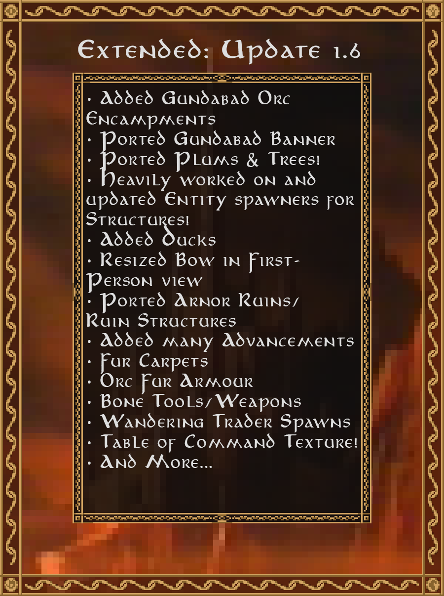

---
show:
  - toc
alias:
  - ver
  - version
  - versions
  - update
  - updates
---

# **Updates**

## **(Beta 1.8.1) (August 20th, 2025)** { #beta-1-8-1 data-toc-label="(Beta 1.8.1)" }
---
??? Changelog
	* Blocks
		* Added the ability to “clip” berry bushes with shears to disable growing berries and growing into hedges
		* Allowed bars and glass to connect to vertical slabs
		* Lowered the light level of Morgul Lanterns and Torches (14->12)
		* Made all 6 Birdcage types rotatable
		* Ported placeable Glass Bottles
	* Entities
		* Added Blue Mountains Butchers
		* Added Blue Mountains Stonemasons
		* Added Hedgehogs
		* Make Hedgehogs hide in hedges when scared
		* Added a domesticated duck variant
		* Made domesticated ducks genderless
		* Wild Ducks now tend to stay away from the player
		* Fixed male Ducks being able to lay eggs
		* Ported Wild Boars
		* Made boars group attack when provoked
		* Made Wild Boars spawn in the Blue Mountains and the Iron Hills
		* Added five variants for wild boars (similar to horses)
		* Fixed Dwarven Miners not spawning in the Iron Hills
		* Fixed several Bree NPCs not having speechbanks
		* Port Blue Mountains Axe Throwers
	* Hired Units
		* Fixed units having holding their base idle weapon on reload instead of player given weapons
		* Units don't cost coins anymore when hired by creative players
	* Items
		* Added Halt/Ready/Summon functionality to the Horn of Command
		* Added Leather Boar Armor
		* Ported Blue Dwarven Boar Armor
		* Ported Dwarven Boar Armor
		* Ported Glass Bottles vessels
	* Localization
		* Fixed BM Merchants leave message missing player name
	* Misc
		* Added loot tables for Middle Earth fishing finally
		* Fixed Blue Mountains Shields being made on ranger crafting tables
		* Fixed Double Bronze advancement not being obtainable on forges other than the Alloy Forge
		* Fixed ELOTR-13 biome dataGen crash
		* Fixed Secrets Of Eol advancement not being obtainable
		* Fixed Tolkien crashing some servers when spawning
		* Fixed crafting and Forging advancements not being bestowed when shift-clicking items out of the result slot
		* Updated several foods with proper saturation values
	* Sounds
		* Added all-new sounds for boars
		* Added all-new sounds for hedgehogs
	* Structures
		* Added despawnable visiting traders to Blue Mountain Settlement trader halls
		* Fixed crystals spawning inside Blue Mountain Settlements
		* Fixed settlements sometimes spawn so low that the shaft does not spawn
		* Fixed silverfish spawning in BM settlement housing (332 blocks exterminated)
		* Re-worked the Blue Mountains Settlements room decorations and add new rooms
	* Textures
		* Added all-new model and texture for Glass Bottles
		* Fixed crucible block model orientation on place
	* Trading
		* Fixed items not shift-clicking into the player sell row slots
		* Fixed traders player sell row items being sometimes lost on GUI close
	* Textures
		* Added a new texture for when horns are in their ready units mode
		* Added all-new Wild Boar skin, armor and armor item textures
		* Fixed duck wing and neck pivot points (old model enableable via config)
		* Fixed z-fighting on the top of the rope model
		* Re-worked vessel rendering to allow for non-flat render types
	* WorldGen
		* Added a new underground blob generator that also processes slabs and stairs (mines look better when rock deposits also modify slabs and stairs)

This update finished what the extended team could not finish for the initial 1.8.0 release. This includes [Wild Hogs]() and [Blue Dwarven Axe Throwers]().
Additionally, this update reworked the design off several parts of the Blue Mountains Settlements. Lastly, [[hedgehog|Hedgehogs]] were added, after being a concept for over a year.

  
  
Beta 1.8.1 Release image

## **(Beta 1.8.0) (July 30th, 2025)** { #beta-1-8-0 data-toc-label="(Beta 1.8.0)" }
---
??? Changelog
	* Blocks
		* Added Cargon Dwarven Door
		* Added Cracked Stone Pillar Slabs
		* Added Cracked Stone Pillars
		* Added Edhelvir Crystal Chandeliers
		* Added Glowstone Crystal Chandeliers
		* Added Gulduril Crystal Chandeliers
		* Added Luigon Dwarven Door
		* Added the ability to right-click with shears to Dead Vines and Willow Vines to stop it from growing
		* Dirt Slabs can now turn into Grass Path slabs by shoveling
		* Fixed Crossed Wattle and Daub not being flammable
		* Fixed Fur Carpets not being flammable
		* Fixed Fur Walls not being flammable
		* Fixed Mordor Moss Vines not being flammable
		* Fixed Wattle and Daub Pillar not being flammable
		* Fixed Wool/Fur Stairs not being flammable
		* Fixed Wool/Fur slabs not being flammable
		* Grass Slabs can now turn into Grass Path slabs by shoveling
		* Grass and Grass path slabs now have two model types, a vanilla (literally) half slab variant, and a full texture variant as they did before. (Clicking and/or shift-clicking with a shovel will alternate the texture)
		* Large Pots can now have items placed inside them (similar to 1.20 pots item storing functionality)
		* Ported (Stone) Dwarven Door
		* Ported Blue Dwarven Chandelier
		* Ported Dwarven Bed
		* Ported Dwarven Chandelier
		* Ported Stone Engraving (writing on stones with chisel)
		* Raised the light level of crystal chandeliers 15->17
		* Renamed Mordor Moss Vines to Dead Moss Vines
		* Stone Engravings now have 8 lines, as opposed to 4 in vanilla and legacy(?)
	* Commands
		* Added lotr_enchant, lotr_modifier, lotrExtendedModifiers commands (aliases)
		* Added /lotrExtendedTrigger to trigger extended events such as wandering trader spawning
	* Compatibility 
		* Fixed the crafting table crash with the JEI-Lotr plugin for JEI (once 1.8.0 releases, there will be no need to use the custom JEI-Lotr build we made)
		* Fixed compatibility with the “Huge Structure Blocks” and “Structure Expansion” mods
	* Config
		* Added a client config setting to allow disabling the Extended client version check
		* Added a client config setting to allow enable/disable EvE between owned hired units
		* Added a client config setting to disable the broken JEI-lotr version check (remove the login spam)
	* Entities
		* Added Blue Mountains Bartenders
		* Added Bree Hobbit Potters
		* Added backend support for most NPC types to be potentially hireable in the future
		* Added dedicated namebanks for blue dwarves
		* Fixed Bree Brewers not being aligned to Bree (they now require alignment to trade)
		* Fixed Bree Sheriffs not carrying Bree Shields
		* Fixed Dwarf, Elf, Orc, and Hobbit traders rendering coins in offhand, even if they are equipped with an item in their offhand
		* Fixed a Renewed bug where Hobbits don’t run from Wargs
		* Fixed a rare bug that caused captains to be hireable by players
		* Fixed units prioritizing following their owner over their current combat target
		* Fixed wandering traders not despawning since 1.7.4? (This will also retroactively fix older traders to despawn once more)
		* Ported Blue Dwarven Commanders
		* Ported Blue Dwarven Miners
		* Ported Blue Dwarven Smiths
		* Ported Bree Hobbit Bakers
		* Ported Bree Hobbit Brewers
		* Ported Bree Hobbit Butchers
		* Ported Bree Hobbit Florists
		* Ported Bree Hobbit Innkeepers
		* Ported Dwarven Commanders
		* Ported Dwarven Miners
		* Ported Dwarven Smiths
		* Re-worked the entire hired unit backend system
		* Removed dedicated hired unit entity types
		* Units now stop stationary mode when attacked and stand again when out of combat
	* Features
		* Ported Bane Modifiers (weapons can get extra damage against a race after killing many of that race)
	* GUI
		* Fixed text sometimes overflowing buttons in the captain’s unit hiring menu
	* Hired Units
		* Added 11 missing hired unit types to current in-game captains
		* Captains can now offer multiple unit types to be hired
		* Fixed hired units dropping double equipment items on death
		* Fixed player inventory items being deleted when shift-clicking items into a hired unit’s equipment inventory
		* Modified hired unit follow distances to be more similar to legacy distances and teleport logic
	* Items
		* Added Blue Dwarven Shield
		* Added Ranger Bows (legacy bow, craftable version)
		* Added the ability to edit engravings (like how latest MC allows for editing signs)
		* Ported Blue Dwarven Throwing Axe
		* Ported Bronze Throwing Axe
		* Ported Dwarven Throwing Axe
		* Ported Iron Throwing Axe
		* Ported Lossarnach Throwing Axe
		* Ported chisel’s functionality to write on blocks
	* Localization
		* Added all-new speechbanks for the dwarves of the Blue Mountains
		* Fixed the lotrExtendedInfo command not being localized
		* Simplified hired unit keys to reduce the shear amount of duplicate translations
		* Updated Chinese (zh_tw) and Russian (ru_ru) translations
	* Loot Tables
		* Large Pots and Bookshelves can now have loot-tables be set
	* Misc
		* Added 1 new secret advancement in Extended (3 currently)
		* Added 117 advancements from Legacy (51.2% currently ported)
		* Added 5 new advancements in Extended (28 currently)
		* Added Dorwinion, Near Harad, Rhûn, and some missed advancements
		* Added recipes for Dead Moss Vines (formerly Mordor Moss Vines) and Birdcages
		* Added support for crafting tables and furnace use and craft advancements
		* Fixed the Minecraft bug in the Advancement screen that causes the change pages buttons to never show in Vanilla (1.12.2->1.21.7+) (should show if more than 26 advancement categories are present)
	* Textures
		* All-new textures for birdcages, dwarven chandeliers, throwing axes, dwarven beds, crucible, crystal chandeliers, large pots, and dead moss vines
		* Blue Dwarven Shields now have an all-new model and texture
		* Crystal Chandelier rendering differences between with/without Optfine
		* Renewed the Blue Mountains male dwarf textures
	* Trading
		* Added better trade pool price validation
		* Clients now know if traders won’t trade because you are in pvp with then (in addition to not having enough alignment)
		* Fixed 6 instances of buy-low sell-high trades
		* Fixed traders not trading proper quantities of items
		* Fixed two player inventory related coin duplication bugs during trading
		* Reduced the sell price of white fur and removed a duplicate Bree smith trade
	* Sounds
		* Added all-new sounds for when Items are placed in the Large Pot
		* New horn sounds
	* Structures
		* Added 4 types of Blue Mountain Smithies
		* Added 9 types of Blue Mountain Strongholds
		* Added Blue Mountain Dwarven Settlements 
		* Added/Ported Blue Mountain Mines
		* Added 50% chance for Bree Sheriff to spawn in Village Manors
		* Added a flag-driven system to add more settings to our custom Jigsaw Pieces
		* Added structure template support for adding foundations to structures on spawn (should make structures spawn more naturally in the world, sort of how legacy handled it)
		* Added structure template support for structure horizontal and vertical shifting
		* Fixed a bree hamlet sign not being processed
		* Fixed entity spawners not spawning entities if player is teleported to the location on the spawner’s first tick
		* Fixed structure pieces (like mines) being able to spawn above the ground
		* Fixed some hobbit structures being submersible
		* Fixed structure foundations not always spawning
		* Hid the name of entity spawners in structures in creative
		* Once and for all fixed structures spawning underwater (might still have rare edge cases, report them if found)
		* Rewrote structure foundation generator to work on any piece
	* WorldGen
		* Added Lapis Ore to the Blue Mountains
		* Added Maple trees to the Shire
		* Fixed Willow Vines not spawning on Willow Trees
		* Made Luigon the main stone type, and stone as the blobs in the Blue Mountains

Blue Mountains Port

  
  
Beta 1.8.0 Release image

## **(Beta 1.7.4) (May 31st, 2025)** { #beta-1-7-4 data-toc-label="(Beta 1.7.4)" }
---
??? Changelog
	* Blocks
		* Added Grass Voids (an internal block to block grass from spawning in buildings on generation)
		* Allowed moss carpets to be placed on leaves and hedges
		* Allowed plants to be placed and grow on full slab faces (except bottom)
		* Berry Bushes now grow into Berry Hedges over a long period of time
		* Fixed Renewed wool slabs and stairs not being flammable and not burning
		* Fixed berry hedge blocks not having a shadow
		* Fixed plants not growing on mud, mud grass or remains ore
		* Made berry bushes slow players a tiny bit
	* Config
		* Added a server setting to enable aggressive captains (unlike current legacy mechanics where they don’t attack unless provoked)
		* Added a server setting to enable aggressive traders(unlike current legacy mechanics where they don’t attack unless provoked)
	* Entities
		* Fixed NPC interaction disabling shield blocking (fixes close combat shield PvE)
		* Fixed Mordor and Uruk archers fighting melee with bows
	* Features
		* Fixed Slab/Stair chairs not working in Singleplayer
	* Hired Units
		* Fixed a bug in which hired units only fast traveled with players when they were set to stationary
		* Fixed hired units not re-equipping base armor
	* Items
		* Added Bucket of Cheese Curds (right click to separate into two items)
		* Fixed cheese curds eating buckets to craft (recipe now gives bucket of cheese curds)
		* Fixed the Ranger Captain egg so the colors match Legacy
	* Localization
		* Fixed several lang mistakes
		* Fixed the config command not being localized
	* Misc
		* Added 1 new secret advancement in Extended (2 currently)
		* Added 4 new advancements in Extended (23 currently)
		* Added a recipe to convert Barren Dirt to Dirt
		* Fixed hired unit dataGen not working for other mods
		* Fixed npc marriage data not saving properly
		* Removed the duplicated Barrow Downs advancements
	* Structures
		* Added a DataPack compatible structure sign randomizer system. 
		* Added all new sign text lists for bree villages and hamlets, houses and professional buildings, as well as in hobbit houses and taverns
		* Fixed hamlets spawning with up to 5 potter buildings (capped at 1 now)
		* Fixed missing loot-tables and spawners in Bree Village stalls and tavern
		* Updated Bree Village Butcher and Stonemason shops so they aren't confused for a house
		* Updated all Bree structures to remove grass spawning inside buildings
	* Textures/Models
		* Fixed fur carpet block frill culling
	* Trading
		* Added different trader trade refusal messages
		* Added legacy trader lockout and refresh logic after trading many items
		* Finished entire trade system datapack compatible backend re-write
		* Fixed traders not handling shift-click buying (no more having to buy one item at a time)
		* Trader menu buttons are now greyed out if player is missing alignment
	* WorldGen
		* Fixed bonemeal spawning Athelas in the Barrow Downs

Bree cleanup and trader backend re-write

  
  
Beta 1.7.4 Release image

## **(Beta 1.7.3) (April 29th, 2025)** { #beta-1-7-3 data-toc-label="(Beta 1.7.3)" }
---
??? Changelog
	* Biomes
		* Added Barrow Downs River (replaces rivers in the barrow downs to fix immersion breaking water color changes)
	* Blocks
		* Added Crucible (only a placeholder for now)
		* Added Stripped Willow Branch
		* Added Stripped Willow Log
		* Added Stripped Willow Log Slab
		* Added Stripped Willow Wood
		* Added Stripped Willow Wood Slab
		* Added Stripped Willow Wood Stairs
		* Added Willow Branch
		* Added Willow Button
		* Added Willow Log Slab
		* Added Willow Pressure Plate
		* Added Willow Sign
		* Added Willow Wood Slab
		* Added Willow Wood Stairs
		* Fixed large pots not having plant particles (like pipeweed)
		* Ported Fallen Willow Leaves
		* Ported Willow Beam
		* Ported Willow Beam Slab
		* Ported Willow Door
		* Ported Willow Fence
		* Ported Willow Fence Gate
		* Ported Willow Leaves
		* Ported Willow Log
		* Ported Willow Planks
		* Ported Willow Sapling
		* Ported Willow Slab
		* Ported Willow Stairs
		* Ported Willow Trapdoor
		* Ported Willow Vines
		* Renamed Berry Plants and Bushes to Berry Hedges and Bushes respectively
		* Standing banners can now be waterlogged
	* Config
		* Added a server config setting to disable Fast Travel to Default Waypoints
		* Added a server config setting to disable Fast Travel to Custom Waypoints
		* Added a server config setting to set dripstone damage fall height (because entities would receive damage of a heart for even a fall of 0.01 blocks)
		* Added a client Hired Unit Death Messages setting to the client settings menu
		* Added a client High Contrast Messages setting to the client settings menu
	* Entities
		* Added Bree-land Cheesemonger
		* Added Bree-land Leatherworker
		* Added Bree-land Stablemaster
		* Added J. R. R. Tolkien
		* Fixed Bree Guards not holding Bree shields
		* Fixed Tolkien spawning list resetting on every server restart
		* Fixed a client crash when rendering rangers with custom helmets (like leather hats)
		* Fixed several entities using wrong skin overrides (textures)
		* Fixed some entities not having correct health set
		* Fixed wandering traders being able to spawn on slabs, stairs, and leaves
		* Made captains non-aggressive like legacy
		* Ported Bree-land Baker
		* Ported Bree-land Brewer
		* Ported Bree-land Butcher
		* Ported Bree-land Florist
		* Ported Bree-land Innkeeper
		* Ported Bree-land Lumberman
		* Ported Bree-land Smith
		* Ported Bree-land Stonemason
		* Removed the interacting lock from captains
	* GUI
		* Added hover messages to the Coin Exchange menu
		* Added warning colors to some banner perm settings to indicate dangerous perms
		* Finished Coin Exchange menu stability overhaul
		* Fixed some banner configuration tooltips not disappearing
		* Made the Hired Unit equipment inventory ranged slot only show for applicable unit types (currently rangers)
		* Re-worked the Hired Unit equipment inventory and added a dedicated ranged weapon slot
		* Re-worked the entire settings menu (and added all client config settings to the settings menu (since Forge does not have the built-in mod config menu anymore))
		* Simplified and fixed unit order selection buttons
	* Hired Units
		* Fixed only Bree Guards having a death message
		* Fixed unit hired confirmation message only saying bree-land guard
		* Units can now have multiple weapon types given by the player and specified in JSON
	* Items
		* Added Willow Boats
	* Loot Tables
		* Added 18 new chest loot-tables for bree village chests (as opposed to a single table for legacy bree chests)
		* Added a separate loot table for hamlet guard houses from normal houses
		* Removed coin drops from hired units
	* Misc
		* Added 1 new advancements in Extended (19 currently)
		* Added 3 advancements from Legacy (33.6% currently ported)
		* Fixed Large Pot and Large Flower Pot recipes (use brick items vs brick blocks)
		* Fixed planks from slab and stair recipes requiring multiple different block ingredients
		* Fixed wood recipes missing recipe "groups"
	* Structures
		* Added Bree Villages
		* Added Building blacklisting (certain builds can now only spawn once in a structure)
		* Added an all new Bree Village Stable and Orchard building
		* Added the ability for irregular structure pieces to spawn (like road lamp posts)
		* Backported Mc1.21 waterloggable jigsaw setting
		* Backported structure max distance template option
		* Made Gundabad Captain tents rarer
		* Made captains that spawn at tents permanent, and captains that randomly spawn at camp centers disappear on death.
		* Universally fixed structures sinking into water by a block in Middle Earth
	* Trading
		* Added Cooked Duck to the Blue Mountains Merchant buy pool
		* Fixed players being to steal items from trader inventories
		* Wandering traders for each biome now spawn at different rates
		* Wandering traders can no longer spawn on leaves, stairs and slabs
	* Textures
		* Add random rotation to the models of Dirt, Coarse Dirt, Barren Dirt, Moss Blocks, Jungle Mud, and Packed Fur
		* Finally fixed the derpy model for leather hats
		* Fixed banners and beds having weird break particles
	* WorldGen
		* Added Willow Trees and made them only spawn near bodies of water
		* Barrow Downs now spawn with a the new Barrow Downs River biome

Added Bree Villages

  
  
Beta 1.7.3 Release image

## **(Beta 1.7.Tolkien) (March 31st, 2025)** { #beta-1-7-tolkien data-toc-label="(Beta 1.7.Tolkien)" }
---
??? Changelog
	* Entities
		* Added J. R. R. Tolkien
	* Misc
		* Fixed several critical bugs that couldn't wait until 1.7.3

April Fools update (Tolkien)

  
  
Beta 1.7.Tolkien Release image

## **(Beta 1.7.2) (February 28th, 2025)** { #beta-1-7-2 data-toc-label="(Beta 1.7.2)" }
---
??? Changelog
	* Blocks
		* Fixed Axes not mining Wattle and Daub blocks faster
		* Ported Bree-land Banner
	* Config
		* Changed structureBlockOutlineViewDistance option from a float to an integer (will cause the value to reset to default)
	* Entities
		* Added Hireable Gundabad Orc Units
		* Added Hireable Dunedain Ranger Units
		* Fixed Structure Entity spawners not rendering debug viewer when in dev mode
		* Ported Gundabad Chieftains
		* Ported Ranger of the North Captains
	* Hired Units
		* Added a Datapack driven system for defining hired units (localization strings, coin cost, pledge requirements, alignment threshold, base gear pools) (This enable modpacks or servers to tweak hired unit parameters)
		* Added a new setting in the options menu to toggle FriendlyFire with hired units owned by the player
		* Fixed some compatibility issues with LOTR: Companions (for R+E1.7.2 + future companions update)
		* Fixed units Friendly Fire not respecting fellowship FriendlyFire settings
		* Fixed units being immune to ally (own) arrows or self lit TNT (enableable via PvHU setting)
		* Fixed units health bars not hiding when F1 is pressed (hideGui)
		* Fixed units not Fast Traveling with their owner
		* Fixed units not being damaged by owners when Friendly Fire was enabled (enableable via PvHU setting now)
		* Fixed units not dropping player supplied equipment when killed.
		* Fixed units not dropping their 9-slot inventory when killed
		* Fixed units reviving themselves with passive healing after death. (becoming undead)
		* Fixed units teleporting onto non-solid or invalid blocks
		* Fixed units teleporting while in mid air
		* Made base equipment not render in inventory when player equipped armor is present
		* Units can now equip skulls, player heads, pumpkins (all 3 variants), and elytra (visual only)
	* Items
		* Added Bree Shields
		* Added a Bree Banner Pattern
		* Added a Hobbit Banner Pattern
		* Buffed Morgul Armor to balance it because it does not have the weapon breaking feature
		* Fixed shears not shearing some blocks faster
		* Nerfed Taurethrim armor stats to align with legacy values
	* Localization
		* Added an initial Bosnian language translation (bs_ba) (Bosanski (Bosna i Hercegovina))
		* Added an initial Croatian language translation (hr_hr) (Hrvatski (Hrvatska))
		* Added an initial French language translation (fr_fr) (Français (France))
		* Added an initial Serbian (Latin) language translation (sr_cs) (Srpski (Srbija))
		* Added localization support for all the hired unit inventory strings
		* Fixed Bree-land strings using Bree-Land
		* Updated Chinese (Taiwan; Mandarin) translation (zh_tw) (繁體中文 (台灣))
		* Updated Renewed’s Chinese (Taiwan) speechbank translations (zh_tw) (繁體中文 (台灣))
		* Updated Renewed’s Chinese (Taiwan) translation (zh_tw) (繁體中文 (台灣))
	* Loot Tables
		* Fixed Bree Hamlets chests sometimes spawning with 25+ bows in a chest
	* Misc
		* Added Gemstone grinding to the Stone Grinder (Ores->Gems for Extended, Renewed, and Vanilla gems)
		* Added chair denied status debug logging to troubleshoot player issues
		* Fixed Stone Grinder turning bricks into bricks
		* Fixed several items being in the wrong creative tabs
		* Fixed two Rohan advancements having flipped names
	* Renewed Patches
		 * Fixed a bug where player alignment bars render even if Team disallows nameplate rendering
		 * Potentially fixed the elusive (Drystone/WattleDaub) connected texture crash (Thanks to everyone who reported this issue, was I was able to track down the potential issue that was causing it, TLDR: Java 9+ changed some things that caused texture queries to sometimes conflict causing a ConcurrentModificationException)
	* Textures
		* Added an all new designed Bree Banner and Shield texture
		* Reworked the leather hat model
		* Updated Dunedain Shield texture
	* Trading
		* Fixed Oddment Collectors selling vanilla emeralds

Hired Unit Fixes

  
  
Beta 1.7.2 Release image

## **(Beta 1.7.1) (January 21st, 2025)** { #beta-1-7-1 data-toc-label="(Beta 1.7.1)" }
---
??? Changelog
	* Blocks
		* Added Crossed Wattle and Daub
		* Added Large Flower Pots (every vanilla/renewed/extended pot placeable plant compatible)
		* Added Mordor Moss Vines
		* Fixed packed/bundled/carpet fur not being shearable
		* Made Fur carpets/slabs/stairs/walls flammable
		* Made Moss Carpets only place on solid blocks (no floating moss now)
	* Entities
		* Added Bree Guard Hired Unit 
		* Added Breeland Potter
		* Fixed Barrow Wights getting stuck in cobwebs
		* Fixed Trader respawners spawning NPCs without giving them items they normally hold
		* Made Barrow Wights have a 1.9 block tall collision box, but a 2.4 block tall hitbox
		* Ported Bree-Land Sheriff
		* Ported Breeland Farmer
	* Commands
		* Fixed the confusing layout of the /fellowship command
	* Config
		* Added a server config global NPC spawn dampening option, defaults to renewed spawn rates (configurable via the lotrExtendedConfig command)
		* Added a server config option to adjust the one-time wight spawn chance
		* Added a server config option to disable stair/slab sitting
		* Added a server config option to disable stair/slab sitting in protected areas
		* Added a server config option to disable stair/slab swapping
	* Features
		* Added a chanced one-time forced wight spawn mechanic (kinda like legacy)
		* Added ability for players to sit on stairs and slabs
		* Added initial Hired Units implementation from LOTR:Companions (almost 1.5 years in works)
		* Added proper light/extinguish ,mechanics for torches (Rclick water drink or bottle to extinguish, Rclick with match or flintNSteel to light)
		* Disabled stone chest GUI opening if a wight spawned
		* Fixed fellowship members not being able to leave the fellowship (only owners could remove people)
		* Fixed fellowships not appearing in the fellowships list for the members
	* GUI
		* Added Hired Unit Gui
		* Added Unit Hiring Gui
	* Items
		* Added Chisels to the list of weapon rack displayable items
	* Localization
		* Fixed Fellowship command not being fully localized
	* Loot Tables
		* Added Loot Tables for Cups,Mugs, Goblets, and Ale Horns (drinks will be randomized in structure vessels going forward)
		* Added Loot Tables for Plates (food will be randomized in structure plates going forward)
		* Added Loot Tables for Weapon Racks (weapons will be randomized in structure weapon racks going forward)
		* Added Stoneware Plates, Hobbit Pancakes, and Hobbit Crafting Tables to Hobbit bartender potential sells
		* Added duck eggs/meat and plums to shire and ranger loot-tables
		* Fixed Butter and Hobbit Pancakes being missing from their respective chest loot-tables
		* Fixed a bug not letting Weapon Racks store a loot-table
		* Fixed the damage for all equipment, weapons, and tools being inverted
	* Misc
		* Added 2 advancements from Legacy (33.1% currently)
		* Changed save format of extended data file
		* Fixed 1.7.0 making it impossible to left-click extinguish fire
		* Fixed Orc Trapdoor and Orc Plating recipes conflicting
		* Fixed boat crafting recipes giving four boats
		* Fixed trading with Rivendell wanderer giving Hobbit farmer achievement
		* Mossy Cobblestone can now be crafted using moss blocks and carpets
	* Sounds
		* Added use sound for Conquest Tables
	* Structures
		* Added Hamlets to Breeland
		* Fixed Entity Spawners in structures bypassing safe spawning checks and raining down entities onto the ground (ranger watchtowers)
		* Fixed a Gundabad Camp chest not having a loot-table
		* Updated Barrow Downs structures with weapon rack loot-tables
		* Updated Gundabad structures with weapon rack, plate and vessel loot-tables
		* Updated Ranger structures with plate and vessel loot-tables
		* Updated Shire structures with plate and vessel loot-tables
	* Textures
		* Added a dedicated item texture for Large Pots and Large Flower Pots
		* Added new Arnor helmet model
		* Added new textures for Arnor armor (worn and items)
		* Fixed Goofy breaking particles for the Reed Basket
		* Removed very outdated legacy texture pack
		* Updated Wildberry item and block textures

Bree Hamlets

  
  
Beta 1.7.1 Release image

## **(Beta 1.7.0) (November 25th, 2024)** { #beta-1-7-0 data-toc-label="(Beta 1.7.0)" }
---
??? Changelog
	* Blocks
		* Added Ancient Rune block (two variants, use chisel to change)
		* Added Large Clay Pot
		* Added Moss Block and Carpet
		* Ported the Stone Grinder (formally the millstone)
	* Commands
		* Added banner protection enable/disable option to the config command
	* Entities
		* Added Bree Wandering Merchant
		* Barrow Wights take no fall damage
		* Fixed Dunedain Ranger’s models not scaling correctly to their new height
		* Fixed Gundabad Uruk Archer name missing "Archer"
		* Orcs spawn wearing fur armor much less now
		* Ported Barrow Wights
		* Removed spears from the Dunedain Rangers spawn equipment pool and added daggers and more sword types
	* Features
		* Added 1.17 Moss block functionality
		* Added Banner Protection
		* Added Barrow Wight Fog
		* Added Barrow Wight jumpscare
		* Made Copper blocks provide an 8x8 banner protection range
	* GUI
		* Added Barrow Down Biome+Label to ME map
		* Made all-new Banner Configuration GUI (currently only four protection slots)
		* Overhauled the Stone Grinder GUI
	* Items
		* Added Hobbit pancake with butter
		* Added butter
		* Made Warg fur helmets only obtainable from killing wargs now, not crafting
		* Ported Hobbit pancake
		* Ported Hobbit pancake with syrup
		* Ported the Chisel
		* Removed Morgul Spear & Dagger
	* Localization
		* Added Bree Merchant SpeechBanks
	* Misc
		* Added 73 new Stone Grinder recipes (slab/stairs/wall -> cracked variants)
		* Added mossy drystone from cobbled drystone recipe
		* Fixed Orc Trapdoor overriding Orc Bar recipe
	* Structures
		* Added barrows to the Barrow Downs (4 small,3 medium,3 large,2 giant)
		* Fixed well ruins being surrounded by air pockets
	* Sounds
		* Added Duck walking (step) sounds (was using chicken step sounds before)
		* Added a Cheese Wheel Slice sound
		* Added new Barrow Wight spawn and death sounds
		* Added new creepy/wight ambiance noises
		* Added new sounds for rope breaking/placing/interacting
		* Fixed cheese wheel playing slice sound on eating
		* Updated Stone Chest close sound
	* Textures
		* Barrow Wights have all new textures and model
		* Barrow Wights change texture and model when angry
		* Hobbit pancakes have all new textures
		* Moss carpets have frills on the edge
	* WorldGen
		* Added Moors grass to the Barrow Downs
		* Added Moss to the Barrow Downs
		* Ported Barrow Downs Biome
		* Remains Ore now generates in the Dead marshes
		* Remains Ore now spawns in swiss cheese like deposits
		* Tweaked Barrow Downs colors

Barrow Downs

  
  
Beta 1.7.0 Release image

## **(Beta 1.6.2) (September 22nd, 2024)** { #beta-1-6-2 data-toc-label="(Beta 1.6.2)" }
---
??? Changelog
	* Blocks
		* Ported Skull Goblet
		* Added Goblin Bricks and Pillar
		* Added Goblin Brick Slab
		* Added Goblin Brick Stairs
		* Added Goblin Brick Wall
		* Added Goblin Pillar
		* Added Goblin Pillar Slab
		* Fixed Rope duping as fast as wild rabbits
		* Fixed Stone Chest not using the new open/close sounds
	* Entities
		* Ported Gundabad Uruk
		* Ported Gundabad Uruk Archer
		* Made Gundabad Uruks spawn naturally in the same 5 biomes as it did in legacy
		* Made Gundabad Orc Archers, Mordor Orc Archers, and Uruk Archers use the Orc Bow
		* Made Entity spawners in structures hide in in f1 mode (in creative)
		* Made Rangers a bit taller (to be more lore accurate)
	* Items
		* Ported Gundabad Uruk Bow
		* Ported Banana Beer
		* Ported Plum Kvass
		* Ported Orc Bow
		* Ported Gundabad Uruk Helmet
		* Ported Gundabad Uruk Chestplate
		* Ported Gundabad Uruk Leggings
		* Ported Gundabad Uruk Boots
		* Ported Gundabad Uruk Cleaver
		* Ported Gundabad Uruk Spear
		* Ported Gundabad Uruk Dagger
	* Localization
		* Overhauled High Elven Speechbanks
	* LootTables
		* Fixed Ranger bow drops not being damaged
		* Fixed Gundabad Camp Wood Chest not applying damage to axes
		* Fixed Banana Cake and Cheese Wheels not dropping when broken if not eaten
		* Nerfed Hobbit Treasure Chest LootTable
	* Misc
		* Added 2 advancements from Legacy (32.6% currently)
		* Changed Creative inv bow ordering
		* Fixed Angmar tools and weapons only being craftable on the vanilla table, instead of the Angmar crafting table
		* Fixed Carved Angmar Brick not having a stonecutter recipe
		* Fixed all Renewed and Extended Carved bricks not having a 2-slab crafting recipe
		* Added additional chiseled block recipes to tie into R+E crafting scheme
		* Added Tags for coins for datapackers/modders
		* Changed Galvorn Ingot recipe to use Elven Steel Ingots instead of Iron Ingots
		* Fixed Advancements having incorrect icons, descriptions, titles, and alignment unlocks
		* Fixed Morgul/Angmar/Dol Guldur weapons not harvesting man flesh
		* Fixed Cake, Banana Cake and Pumpkin Pie not being craftable with duck eggs
		* Made Fur Bundles craftable on the vanilla crafting table
		* Made Near Harad a friend of Dunland (to be lore accurate to history)
	* Structures
		* Added Orc spawners to some well ruins, and more ranger spawners to several layers of the ranger watchtower
		* Raised the default respawn time and minimum player distance for entity spawners in structures
	* Textures
		* Updated Dale armor item textures in the Redone Renewed resource pack
		* Updated Dorwinion Elven armor item textures in the Redone Renewed resource pack
		* Updated Harad armor item textures in the Redone Renewed resource pack
		* Updated Harnennor armor item textures in the Redone Renewed resource pack
		* Updated Ithilien Ranger armor item textures in the Redone Renewed resource pack
		* Updated Umbar armor	item textures in the Redone Renewed resource pack
		* Updated Rohan Marshal armor item textures in the Redone Renewed resource pack
		* Updated Dunlanding armor item textures in the Redone Renewed resource pack
	* Trading
		* Fixed quick stacking removing items directly from trade menu
		* Fixed players from placing items in "Buy Items" inventory (causing a crash)
		* Fixed Oddment collector missing two departure speech lines
		* Raised Rivendell Wanderer’s required alignment to trade to 100
	* WorldGen
		* Fixed Berry Bushes(Plants) spawning outside of the Middle Earth dimension

Gundabad Uruks

  
  
Beta 1.6.2 Release image

## **(Beta 1.6.1) (September 7th, 2024)** { #beta-1-6-1 data-toc-label="(Beta 1.6.1)" }
---
??? Changelog
	* Blocks
		* Added Bone Block Slab
		* Added Bone Block Stairs
		* Added Bone Block Wall
		* Added Mossy Arnor Pillar Slabs
		* Added Mossy Arnor Pillars
		* Added Orc Steel Chain
		* Changed Packed fur block tab (decoration->building)
		* Ported Rope
	* Items
		* Added legacy ability for different bows to have different draw speeds
		* Fixed Bow models rendering incorrectly in first-person view
		* Fixed Ranger Bow and Longbows not being repairable. (Repairable with Bowstring now)
		* Ported Orc Bow
	* Entities
		* Added Trader Respawners (that floating coin thingy)
		* Gundabad Orc Traders equip warg armor with same rarity as Gundabad Warg color rarity
		* Made Ducks Spawn naturally
		* Made Elven Traders properly hold coins in their hand
		* Mordor Orcs can now spawn with Black and Brown Warg Fur armor
		* Ported Blue Mountains Wandering Trader
		* Ported Gundabad Orc Scrounger (found in orc encampments)
	* Localization
		* Fixed Dunedain Banner Patterns not using accented Dunedain description
		* Updated Chinese (Taiwan) translation (zh_tw)
	* Loot Tables
		* Applied Random Damage to all Structure Chest loot-table's Armor/Tools/Weapons
		* Overhauled Gundabad Camp Supply Chest loot-tables (32 -> 73 items)
	* Misc
		* Added 1 advancements from Legacy (32.3% currently)
		* Added 2 new advancements in Extended (18 currently)
		* Added Gemstone Smelting Recipes for furnaces
		* Added Recipes to convert between different torch types
		* Added Warg Fur Armor and Bone Weapon/Tools to Gundabad and Isengard Orc equipment pools
		* Allowed Melon and Pumpkin stems to grow Melons and Pumpkins on Barren Dirt
		* Changed Advancement Colors
		* Fixed Extended’s Bookshelves not supplying enchanting power to Enchanting Tables
		* Fixed Java 9+ compatibility issues in renewed
		* Fixed roast duck recipe unlocking from conkers
		* Made Berries, Berry Bushes, Conkers, Roasted Chestnuts, Plums, Bananas, and Banana Bread compostable
		* Made Cheese Wheels, Cherry Pie, Apple Crumble, Cake (vanilla mc cake) drop as an item if there a no bites when broken (normally they can never be picked back up once placed)
	* Sounds
		* Add new Unique Open/Close sounds for the Stone Chest
	* Structures
		* Added Gundabad Encampments (6 variants)
		* Disabled Large Hobbit Hole spawning due to issues with it
		* Fix wood pallets incorrectly handling vanilla verticalized slabs
		* Fixed Ranger Hideouts being in Lone Lands and Eriador (needs to be in forested areas)
	* Textures
		* Remastered Orc Bow texture
		* Synced Bow model speed to bow dependent Draw Speed
		* Updated Bedroll texture
		* Updated Gray and Silver Packed fur and Bundled fur block textures
		* Updated Gray and Silver fur textures
		* Updated Rope item texture
		* Updated White and Black Packed fur and Bundled fur block textures
		* Updated White and Black fur texture
		* Updated all Warg armor models and textures
	* Trading
		* Added 7 Missing Trades back to Hobbit Bartender (including Smoking Pipe)
		* Added Depart and Death chat messages for wandering traders
		* Corrected biome lists so all currently added Wandering Traders properly spawn in it’s legacy biomes
		* Fixed client crash when shift-clicking on a sold-out trade slot
		* Make spawn message match format of legacy
		* Prevent wandering traders from spawning for players in creative or spectator game modes
		* Updated shift-click buying only buying a max of 64 items, not ultra-maxing out your inventory
	* WorldGen
		* Made Berry Bushes Spawn Naturally in approximately all the same legacy biomes

Gundabad encampments

  
  
Beta 1.6.1 Release image

## **(Beta 1.6.0) (August 7th, 2024)** { #beta-1-6-0 data-toc-label="(Beta 1.6.0)" }
---
??? Changelog
	* Blocks
		* Added Banana Branch
		* Added Banana Wood
		* Added Banana Wood Slab
		* Added Banana Wood Stairs
		* Added Black Warg	Fur Carpet
		* Added Brown Warg	Fur Carpet
		* Added Gray Warg	Fur Carpet
		* Added Orc Barrel
		* Added Orc Steel Door
		* Added Orc Steel Trapdoor
		* Added Plum Branch
		* Added Plum Wood
		* Added Plum Wood Slab
		* Added Plum Wood Stairs
		* Added Silver Warg	Fur Carpet
		* Added Stripped Banana Branch
		* Added Stripped Banana Wood
		* Added Stripped Banana Wood Slab
		* Added Stripped Banana Wood Stairs
		* Added Stripped Plum Branch
		* Added Stripped Plum Log
		* Added Stripped Plum Log Slab
		* Added Stripped Plum Wood
		* Added Stripped Plum Wood Slab
		* Added Stripped Plum Wood Stairs
		* Added White Warg	Fur Carpet
		* Made Conquest Table change texture by Shift-Click placing
		* Made Conquest Table place directional
		* Ported Blue Mountains Banner
		* Ported Durin’s Folk Banner
		* Ported Fallen Plum Leaves
		* Ported Gundabad Orc Banner
		* Ported Morgul Chandelier
		* Ported Orc Chandelier
		* Ported Plum Beam
		* Ported Plum Beam Slab
		* Ported Plum Button
		* Ported Plum Door
		* Ported Plum Fence
		* Ported Plum Fence Gate
		* Ported Plum Leaves
		* Ported Plum Log
		* Ported Plum Log Slab
		* Ported Plum Planks
		* Ported Plum Planks Slab
		* Ported Plum Planks Stairs
		* Ported Plum Pressure Plate
		* Ported Plum Sapling
		* Ported Plum Sign
		* Ported Plum Trapdoor
		* Ported Uruk Chandelier
	* Commands
		* Added a command to set extended server config values in-game (sort of like /gamerules)
		* Fixed a few issues with the fellowship command
	* Entities
		* Added Ducks
		* Added many Vanilla, Renewed, and Extended foods as duck feedables
		* Implemented a system for making gendered mobs
		* Made ducks use different textures based upon gender
	* GUIs
		* Made Trader GUI close when button clicked with low alignment
		* Optimized the layout of the Options GUI
	* Items
		* Added Black Warg Helmet, Chestplate, Leggings, Boots
		* Added Bone Axe
		* Added Bone Dagger
		* Added Bone Hoe
		* Added Bone Pickaxe
		* Added Bone Shovel
		* Added Bone Spear
		* Added Bone Sword
		* Added Brown Warg Helmet, Chestplate, Leggings, Boots
		* Added Cooked Duck Meat
		* Added Duck Meat
		* Added Duck eggs that ducks randomly drop currently how chickens work too (These duck eggs spawn baby ducks)
		* Added Gray Warg Helmet, Chestplate, Leggings, Boots
		* Added Gundabad Banner Pattern
		* Added Gundabad Shield
		* Added Plum Boat
		* Added Silver Warg Helmet, Chestplate, Leggings, Boots
		* Added White Warg Helmet, Chestplate, Leggings, Boots
		* Ported Plum
	* Language
		* Added Chinese (Taiwan) translation (zh_tw)
		* Added dedicated speech-banks for a Hobbit Bartenders and Farmers
		* Added localization for bow stats (damage, range, speed)
		* Added localization for the entire fellowship command
		* Fixed a typo with Dunedain Banners
		* Updated Russian localization
	* Misc
		* Added 2 new advancements in Extended (16 currently)
		* Added 52 advancements from Legacy (31.9% currently)
		* Added a message in the Fellowship GUI to use the command
		* Added a setting for servers to require metal doors and trapdoors added by extended to be powered to open
		* Changed Morgul Lantern recipe to use one Morgul Torch surrounded by Orc Steel Nuggets
		* Enabled Renewed ResourcePack by default
		* Fixed an issue with consuming advancements triggering by just holding the item
		* Made Bedrolls, Branding Irons, and Orc Barrels use forge:leather tag in their recipes (allowing for modded leathers to be used)
		* Tweaked Chest loot-tables across the board to reduce the rate of OP loot
		* Updated Advancement Task/Goal/Challenge colors
		* Updated Master Hunter advancement to use warg armors instead of fur armor
	* Sounds
		* Added all new Hurt, Death and Ambiance sounds for Ducks
		* Added new Reed Basket Open/Close sounds
	* Structures
		* Added General Ruin altar variants (12 small, 8 large, 4 grand)
		* Added General Ruined Turret variants (4 versions)
		* Added General Ruined Wall variants (7 states of decay)
		* Added General Ruined Wells variants (10 versions)
		* Added Gundabad Camps in all applicable renewed biomes
		* Added Ruined Arnor Towers (12 versions)
		* Added Ruins structures to the Trollshaws
		* Finished DataDriven (dataPackable) Entity Spawner System for Structures
		* Finished Dynamic Wood Pallets for Structures. (WIP since December) (All Vanilla+Renewed+Extended Wood pallets)
		* Fixed Ranger Camp fir wood type sometimes spawning halved firepits
		* Nerfed structure spawn rates across the board to spread structures out a bit more
		* Tweaked Ruin pools to have make some structures spawn more than others
		* Updated all relevant structures with the new entity spawner
	* Textures
		* Finally added a model and textures to the Conquest Table
		* Fixed Small banners having a dark shadow shading
		* Remastered Blue Mountains Banner texture
		* Remastered Durin’s Folk Banner texture
		* Remastered Gundabad Orc Banner texture
		* Remastered Morgul Chandelier texture
		* Remastered Orc Chandelier texture
		* Remastered Plum Wood type textures
		* Remastered Plum texture
		* Remastered Uruk Chandelier texture
	* Trading
		* Added a tooltip that shows the cooldown and number of items left on a trade
		* Allowed talking to traders even if you don't have the required alignment to trade/exchange coins with them
		* Implemented new Wandering Trader system

Gundabad Camps

  
  
Beta 1.6.0 Release image

**Note:** This version was re-uploaded to fix a critical bug

## **(Beta 1.5.2) (June 25th, 2024)** { #beta-1-5-2 data-toc-label="(Beta 1.5.2)" }
---
??? Changelog
	* Blocks
		* Fixed a bug with bedroll events and players spawning in servers for first time
		* Fixed Hobbit and Dunedain banner’s dropping incorrectly (double or nothing drops)
	* Language
		* Fixed a typo with Hobbit Banners
	* Misc
		* Added more compat for Lotr: Companions
		* Added server setting to disable fishing enchanted items in Middle Earth
		* Remove broken hacky fishing loot-table
	* Structures
		* Fixed structure block items being saved in some ranger tents

Fixes a server crash with bedrolls and players spawning

## **(Beta 1.5.1) (June 21st, 2024)** { #beta-1-5-1 data-toc-label="(Beta 1.5.1)" }
---
??? Changelog
	* Blocks
		* Added Hanging Bananas
		* Fixed an infinite berry glitch with bushes
		* Made Bedrolls not set the players spawnpoint
		* Made banner size toggleable by shift clicking
		* Merged Chestnut Flowery Leaves with Chestnut Leaves
		* Ported Cracked Arnor Pillar
		* Ported Cracked Arnor Pillar Slab
		* Ported Dunedain Banner
		* Ported Hobbit Banner
	* Entities
		* Added more unique death loot-tables to traders
		* Fixed Dunedain Rangers not spawning with Iron Swords and having a double rate to spawn with an Arnor Spear
		* Fixed Elven Wanderers hair still showing despite them having hoods
	* Items
		* Added Banana Tree Gen to Banana Saplings
		* Fixed Dunedain Bow and Longbow not having drawing animations
		* Ported barrow blades
	* Language
		* Added Chinese translation
		* Added Russian Translation
		* Added Speechbanks for Blue Mountains Dwarf Archers
		* Added Speechbanks for Bree
		* Fixed Galadhrim Wanderer not having speachbanks
	* Misc
		* Added 4 new (non-legacy) advancements
		* Added 52 advancements from Legacy (7.8%) (Includes Assorted General, Eriador and Shire categories)
		* Added Dunedain Banner Pattern recipe using the Dunedain Banner
		* Added Trader (entity) buy/sell advancement triggers
		* Added Trader item specific buy/sell advancement triggers
		* Adjusted Berry Nutrition and Saturation values
		* Adjusted Cheese Slice, Banana, Banana Bread, and Roasted Chestnut saturation values
		* Fixed a bug that made it impossible to make custom waypoints
		* Adjusted ranger structure chest loot-table weights
	* Structures
		* Added Arnor Ruins (3 variants)
		* Added Ranger Forts, Encampments (with captain variant)
		* Added ranger Structures to the Enedwaith biome
		* Tweaked ranger structure spawn distances
		* Updated ranger structures to have banners on both sides
	* Textures
		* Added More Variations to Chestnut Flower Leaves texture
		* Added More Variations to Chestnut Leaves texture
		* Remastered Wood-Elven Armor Item textures (Renewed Pack)
		* Changed Chestnut Leaves texture weights
		* Fixed Jungle Mud Grass Snowy texture being gone (since beta 1.3ish)
		* Updated Amber Block texture
		* Updated Amber Ore texture
		* Updated Amber texture
		* Updated Banana texture
		* Updated Black Uruk Ingot texture
		* Updated Blackberry Bush texture
		* Updated Blackberry Plant texture
		* Updated Blackberry texture
		* Updated Bowstring texture
		* Updated Gilded Iron texture
		* Updated Morwaith Crafting Table texture
		* Updated Obsidian Shard texture
		* Updated Pearl texture
		* Updated Silver Coin (1) texture
		* Updated Silver Coin (10) texture
		* Updated Silver Coin (100) texture
		* Updated Warg Bone texture (Renewed Pack)
	* Trading
		* Fixed a few trader issues
		* Restricted trading with traders to a set alignment threshold (trader specific value)

Added Ranger encampments

  
  
Beta 1.5.1 Release image

## **(Beta 1.5.0) (May 14th, 2024)** { #beta-1-5-0 data-toc-label="(Beta 1.5.0)" }
---
??? Changelog
	* Blocks
		* Added Ability for Weapon Racks to have loot-tables
		* Added Aged Cheese Wheel
		* Added Barren Dirt Slabs
		* Added Bedroll
		* Added Coarse Dirt Slabs
		* Added Dirt Slabs
		* Added Fallen Banana Leaves
		* Added Fallen Chestnut Leaves
		* Added Grass Block Slabs
		* Added Grass Path Slabs
		* Added Mycelium Slabs
		* Added Ornate Golden Rohan Beams
		* Added Ornate Rohan Beams
		* Added Podzol Slabs
		* Added Stripped Banana Log
		* Added Stripped Banana Log Slab
		* Bookshelves work as book storage (book, written book, writable book, red book, book of true silver, knowledge book)
		* Changed the Cheese Wheel eat sound
		* Ported Banana Beam
		* Ported Banana Beam Slab
		* Ported Banana Button
		* Ported Banana Cake
		* Ported Banana Door
		* Ported Banana Fence
		* Ported Banana Fence Gate
		* Ported Banana Leaves
		* Ported Banana Log
		* Ported Banana Log Slab
		* Ported Banana Planks
		* Ported Banana Planks Slab
		* Ported Banana Planks Stairs
		* Ported Banana Pressure Plate
		* Ported Banana Sign
		* Ported Banana Trapdoor
		* Ported Carved Black Umbar Brick
		* Ported Carved Umbar Brick
		* Ported Golden Rohan Beams
		* Ported Rohan Beams
		* Ported Weapon Rack
		* Ported the Reed Basket
	* Entities
		* Added 154 new entity name combinations for other races
		* Added 309 new entity name combinations for Orcs
		* Overhauled the Ranger of the North's speechbank
		* Ported Galadhrim Wanderers
		* Ported Ranger of the North
		* Ported Rivendell Wanderers
	* Features
		* Made Cheese Wheels age (kinda like 1.17 copper blocks)
		* Made Grass spread from Grass Block Slabs to Dirt Slabs and Dirt Blocks
		* Made Grass spread from Grass Blocks to Dirt Slabs
		* Made Mycelium spread from Mycelium Blocks to Dirt Slabs
		* Made Mycelium spread from Mycelium Slabs to Dirt Slabs and Dirt Blocks
	* Items
		* Added 3 new banner patterns: Durin, Dunedain, Blue Mountains
		* Added Aged Cheese Slice
		* Added Banana Boat
		* Added Bowstring
		* Added Dunedain Shield
		* Added Longbow
		* Fixed Branding Irons not using durability when branding
		* Fixed Taurethrim Sword not giving knock-back (club behavior)
		* Ported Banana
		* Ported Banana Bread
		* Ported Banana Sapling
		* Ported Dunedain Bow
		* Tweaked the Morgul, Angmar, and Dol Guldur attack and durability values to align with legacy’s
		* Tweaked the rendering positions of extended's bed items
	* Misc
		* Add 114 missing stonecutter recipes for extended's blocks
		* Add 3 missing stonecutter recipes for renewed's blocks
	* Structures
		* Added Ranger Hideout Houses
		* Added Ranger Hideouts
		* Added Ranger Ruined Houses
		* Fixed a crash when generating kegs in taverns
		* Fixed the Large Hobbit Tavern bartender escaping the bar
		* Fixed the Large Hobbit Tavern basement being blocked by dirt
		* Ported Ranger Watchtowers
		* Ported and Re-designed Ranger Camps
		* Removed Large (Hobbit Hole/Tavern) from shire moors, white downs, and shire woodlands
	* Textures
		* Added a remastered texture for mallorn swords to the renewed pack
		* Added a remastered texture for the Blacksmith Hammer texture to the renewed pack
		* Changed extended's beds break particle texture
		* Fixed Mud Path Slab double slab graphical glitch
		* Fixed Ranger and Hobbit Table Bottoms in Renewed Pack having invalid textures
		* Fixed Wood and Log slab texture rotations
		* Remastered All Banana Wood type textures
		* Remastered Ranger Armor item textures
		* Updated Amber Block texture
		* Updated Amber Ore texture
		* Updated Amber texture
		* Updated Amethyst texture
		* Updated Angmar's Tools, Weapons and Armor textures
		* Updated Blackberry Bush texture
		* Updated Blackberry Plant texture
		* Updated Blackberry texture
		* Updated Carved Dol Guldur Brick texture
		* Updated Chestnut Leaves texture
		* Updated Cracked Dol Guldur Brick texture
		* Updated Dol Guldur Brick texture
		* Updated Dol Guldur Crafting Table texture
		* Updated Dol Guldur Pillar texture
		* Updated Dol Guldur's Tools, Weapons and Armor textures
		* Updated Galvorn Ingot texture
		* Updated Gilded Iron Ingot texture
		* Updated Mossy Dol Guldur Brick texture
		* Updated Mossy Mud Brick texture
		* Updated Pearl Block texture
		* Updated Pearl texture
		* Updated Topaz Block texture
		* Updated Topaz Ore texture
		* Updated Topaz texture
		* Updated Wildberry Bush texture
		* Updated Wildberry Plant texture
		* Updated Wildberry texture
		* Updated the Rivendell Armor item texture in the renewed pack
	* Trading
		* Fixed a server crash when trading with traders
		* Made Coins with custom NBT data not tradable

Added Ranger Camps

  
  
Beta 1.5.0 Release image

## **(Beta 1.4.3) (March 31st, 2024)** { #beta-1-4-3 data-toc-label="(Beta 1.4.3)" }
---
??? Changelog
	* Blocks
		* Allowed for plants to be placed on barren dirt
	* Entities
		* Tweaked the AI of some traders
	* Misc
		* Fixed Chestnut Planks recipe still being broken
		* Fixed Container names being removed (bug with addition of inv coin totals)
	* Structures
		* Ported the Large Hobbit Tavern
		* Fixed the Large Hobbit Hole chimneys not spawning
		* Fixed the Large Hobbit Hole entrance chests not having loot
		* Fixed the Large Hobbit Hole floating/not having foundations
		* Fixed some Large Hobbit Hill piece bugs
		* Structures should now only rarely spawn on roads ()-()
		* Updated the Large Hobbit Hill shape
	* Textures
		* Remastered 7/13 Adult Female Hobbit Skins
		* Fixed Renewed Hobbit textures not applying when selecting the renewed resource pack
		* Updated Morgul Steel Ingot texture
	* Trade System
		* Added coin total within creative inventory
		* Added coin total within Faction crafting tables
		* Added coin total within Furnace screens
		* Added coin total within Blast Furnace screens
		* Added coin total within Hobbit Ovens and all LOTR Alloy forges
		* Added coin total within pouches
		* Added coin total within the crafting table
		* Fixed coin totals being hidden when in creative

Large Hobbit Tavern and other Fixes

  
  
Beta 1.4.3 Release image

**Note:*** This release was originally on March 30th, but was re-uploaded to fix a critical bug 
## **(Beta 1.4.2) (March 27th, 2024)** { #beta-1-4-2 data-toc-label="(Beta 1.4.2)" }
---
??? Changelog
	* Blocks
		* Added Black Fur bed
		* Added Gray Fur bed
		* Added Silver Fur bed
		* Added Smoke Particles to Morgul torches
		* Added White Fur bed
		* Ported Fur bed
		* Ported Obsidian Dwarven Brick
		* Ported Obsidian Dwarven Brick Slab
		* Ported Obsidian Dwarven Brick Stairs
		* Ported Obsidian Dwarven Brick Wall
		* Ported Orc bed
		* Ported Straw Bed
	* Features
		* Gems now spawn naturally throughout Middle-Earth
	* Misc
		* Fixed Chestnut Planks recipe being a sign recipe
	* Structures
		* Added the Large Hobbit Hole
	* Textures
		* Fixed texture issues for all pillar slabs
		* Remastered 13/13 Adult Male Hobbit Skins
		* Remastered 3/13 Adult Female Hobbit Skins
		* Remastered Fur Bed texture
		* Remastered Obsidian Dwarven Brick texture
		* Remastered Orc Bed texture
		* Remastered Straw Bed texture
		* Tweaked the mud path texture layout
	* Trade System
		* Added coin total to the player inventory screen
		* Added coin total within chests (including stone chests)

Large Hobbit Hole and fur beds

  
  
Beta 1.4.2 Release image

## **(Beta 1.4.1) (March 16th, 2024)** { #beta-1-4-1 data-toc-label="(Beta 1.4.1)" }
---
??? Changelog
	* Blocks
		* Fixed being unable to cut cheese wheels if not hungry or in creative
		* Made all of Renewed's Torches Toggleable
	* Entities
		* Fixed loot-tables to use extended's loot-tables (proper warg fur color, etc)
	* Features
		* Added Chestnut Trees to remaining legacy spawning biomes that have been currently ported
	* Items
		* Made Conkers Throwable and Dispensable
	* Textures
		* Fixed the broken Scorched Stone rotated textures
		* Fixed Mud's texture seemingly rotating itself
		* Updated Sapphire Ore texture
		* Fixed the Built-in Legacy and Renewed ResourcePacks always being disabled on start (even if you had previously enabled them)
	* Trade System
		* Fixed Buggy Behavior when coins are dispensed when trading
		* Added Total Coin Earnable to Trade GUI
		* Fixed buggy behavior caused by clicking traders with a spawn egg

Fixes

## **(Beta 1.4.0) (March 12th, 2024)** { #beta-1-4-0 data-toc-label="(Beta 1.4.0)" }
---
??? Changelog
	* Blocks
		* Added Chestnut Branch
		* Added Chestnut Wood
		* Added Chestnut Wood Slab
		* Added Chestnut Wood Stairs
		* Added Cracked Mud Bricks
		* Added Cracked Red Rhûnic Brick
		* Added Cracked Red Rhûnic Brick Slab
		* Added Cracked Red Rhûnic Brick Stairs
		* Added Cracked Red Rhûnic Brick Wall
		* Added Green Flame Block
		* Added Green Flame Hearth
		* Added Mossy Mud Bricks
		* Added Mossy Red Rhûnic Brick
		* Added Mossy Red Rhûnic Brick Slab
		* Added Mossy Red Rhûnic Brick Stairs
		* Added Mossy Red Rhûnic Brick Wall
		* Added Scorched Brick
		* Added Scorched Brick Slab
		* Added Scorched Brick Stairs
		* Added Scorched Brick Wall
		* Added Scorched Cobblestone Slab
		* Added Scorched Cobblestone Stairs
		* Added Scorched Cobblestone Wall
		* Added Scorched Stone
		* Added Scorched Stone Slab
		* Added Scorched Stone Stairs
		* Added Scorched Stone Wall
		* Added Stripped Chestnut Branch
		* Added Stripped Chestnut Log
		* Added Stripped Chestnut Log Slab
		* Added Stripped Chestnut Wood
		* Added Stripped Chestnut Wood Slab
		* Added Stripped Chestnut Wood Stairs
		* Fixed Morgul Torch not having it's new custom particle
		* Made the particles and output light for extended's torches toggleable
		* Ported Barren Dirt
		* Ported Chestnut Beam
		* Ported Chestnut Beam Slab
		* Ported Chestnut Button
		* Ported Chestnut Door
		* Ported Chestnut Fence
		* Ported Chestnut Fence Gate
		* Ported Chestnut Leaves
		* Ported Chestnut Log
		* Ported Chestnut Log Slab
		* Ported Chestnut Planks
		* Ported Chestnut Planks Slab
		* Ported Chestnut Planks Stairs
		* Ported Chestnut Pressure Plate
		* Ported Chestnut Sign
		* Ported Chestnut Trapdoor
		* Ported Scorched Cobblestone
		* Ported Stone Chest
	* Items
		* Added Chestnut Boat
		* Added Orc Steel Nugget
		* Gave Horn of Command a different texture depending on its type (ready/halt or summon)
		* Made Bottle of Poison stack to 16
		* Ported Chestnut Sapling
		* Ported Taurethrim Dagger
		* Ported Taurethrim Spear
		* Porting Branding Iron
	* Entities
		* Ported Oddment Collector
	* Features
		* Added Chestnut Trees to the Shire Biomes
		* Added Chestnut Trees with Beehives
		* Added Large Chestnut Trees with Beehives
		* Ported Chestnut Party Trees
		* Ported Chestnut Trees
		* Ported Large Chestnut Trees
	* Misc
		* Added Stats for Slicing Cheese Wheels, Creating Fellowships, Disbanding Fellowships, and Trading with Traders
		* Added more waypoint config options for servers
		* Fixed Cheese Slices not adding to the statistic when eaten
		* Fixed Stats not using their localized description names
		* Fixed horn sounds not playing
		* Remapped ID Grey Fur -> Gray Fur
	* Structures
		* Added Alternate Variants For Hobbit Picnic tables, Small Hole, and Tavern
		* Added Roasted Chestnuts and Conkers to Hobbit Structure loot-tables
		* Changed Hobbit House spawn distributions
		* Fixed Shire structures not spawning in Shire Woodlands, Shire Moors, or the White Downs
		* Fixed some Shire Structure chests not having loot
		* Updated Hobbit Barn, House, and Windmill
	* Textures
		* Added Cheese Curds texture
		* Added pack image for legacy textures resourcepack
		* Fixed Legacy texture pack remains ore
		* Fixed missing texture for Dwarf Remains Ore
		* Remastered All Chestnut Wood type textures
		* Remastered Jungle Grass texture
		* Remastered Lindon and Rivendell armor texture in renewed resource pack
		* Remastered Taurethrim Dagger texture
		* Remastered Taurethrim Spear texture
		* Revamped Packed Fur textures
		* Updated Amethyst Block texture
		* Updated Amethyst Ore texture
		* Updated Angmar Equipment textures
		* Updated Angmar Weapons/Tools textures
		* Updated Black Fur texture
		* Updated Carved Dol Guldur Brick texture
		* Updated Carved Red Rhûnic Brick texture
		* Updated Coin(1,10,100) textures
		* Updated Cracked Dol Guldur Brick texture
		* Updated Diamond Ore texture
		* Updated Diamond texture
		* Updated Dol Guldur Brick texture
		* Updated Dol Guldur Crafting Table texture
		* Updated Dol Guldur Equipment textures
		* Updated Dol Guldur Pillar texture
		* Updated Dol Guldur Weapons/Tools textures
		* Updated Elderberry texture
		* Updated Emerald Block texture
		* Updated Emerald Ore texture
		* Updated Emerald texture
		* Updated Galvorn Block texture
		* Updated Galvorn Ingot texture
		* Updated Gilded Iron Block texture
		* Updated Ithildin texture
		* Updated Morgul Equipment textures
		* Updated Morgul Lantern texture
		* Updated Morgul Steel Ingot texture
		* Updated Mossy Dol Guldur Brick texture
		* Updated Mud Brick texture
		* Updated Mud Path texture
		* Updated Mud Farmland textures
		* Updated Mud texture
		* Updated Opal Ore texture
		* Updated Pearl Block texture
		* Updated Raspberry texture
		* Updated Red Rhûnic Brick texture
		* Updated Red Rhûnic Pillar texture
		* Updated Rhûnic Crafting Table texture
		* Updated Ruby Block texture
		* Updated Ruby Ore texture
		* Updated Ruby texture
		* Updated Silver Fur texture
		* Updated Taurethrim Equipment textures
		* Updated Taurethrim Weapons/Tools textures
		* Updated Topaz Ore texture
		* Updated Topaz texture
		* Updated White Fur texture
	* Trading System
		* Ported NPC trading, Hobbit Bartender, Farmer, and Oddment Collector trades

SGSv5

  
  
Beta 1.4.0 Release image

## **(Beta 1.3.0) (February 13th, 2024)** { #beta-1-3-0 data-toc-label="(Beta 1.3.0)" }
---
??? Changelog
	* Blocks
		* Added Gold Trimmed Rhûnic Brick Slab
		* Added Gold Trimmed Rhûnic Brick Stairs
		* Added Gold Trimmed Rhûnic Brick Wall
		* Added Jungle Mud Path Stairs
		* Added Jungle Mud Stairs
		* Added Remains Ore (Man, Orc, Elf, and Dwarf variants)
		* Added Smooth Stone Stairs
		* Added a Cheese Wheel
		* Added a Stone Taurethrim Crafting Table variant
		* Added custom particles for Morgul Torches
		* Fixed Berry Plants planting as full plants
		* Fixed Incorrect Rotation for Morgul Torches
		* Ported Black Carved Gondor Brick
		* Ported Jungle Farmland
		* Ported Jungle Grass Block
		* Ported Jungle Mud
		* Ported Jungle Mud Bricks
		* Ported Jungle Mud Bricks Slab
		* Ported Jungle Mud Bricks Stairs
		* Ported Jungle Mud Bricks Wall
		* Ported Jungle Mud Path
		* Ported Jungle Mud Path Slab
		* Ported Jungle Mud Slabs
	* Items
		* Added Cheese Curds
		* Added Morgul Dagger
		* Added Morgul Spear
		* Added an edible Cheese Slice
		* Fixed Tools and Swords incorrect handheld item rotation
		* Ported Angmar Dagger
		* Ported Angmar Spear
		* Ported Dol Guldur Dagger
		* Ported Dol Guldur Spear
		* Ported Conker
		* Ported Roasted Chestnuts
	* Features
		* Added Hobbit Picnic Blankets
		* Added Hobbit Picnic Tables
		* Fixed Hobbit farmers escaping the barn
		* Made structure spawn earlier on chunk creation, stopping them from generating on top of trees
		* Made structures locatable with the /locate command
		* Revamped structure generation system (SGSv5)
	* Misc
		* Added DataGen for stats description localization
		* Changed some logging levels
		* Fixed typo in White Packed Fur blocks spellings
		* Re-locked ME map to east-south bounds
	* Textures
		* Fixed a minor pixel error on Morgul Steel Block texture
		* Fixed swapped Morgul block textures
		* Remastered Angmar Dagger texture
		* Remastered Dol Guldur Dagger texture
		* Remastered the bottom texture of 9 renewed crafting tables (put in the renewed built-in pack)

Misc and hobbit stuff

## **(Beta 1.2.1) (January 17th, 2024)** { #beta-1-2-1 data-toc-label="(Beta 1.2.1)" }
---
??? Changelog
	* Entities
		* Stop Hobbit traders naturally despawning
	* Misc
		* Remove extra space hiding in Black Fur Bundle lang
		* Added support for patch versions in the update checker

Fix despawning hobbit traders

## **(Beta 1.2) (January 16th, 2024)** { #beta-1-2-0 data-toc-label="(Beta 1.2)" }
---
??? Changelog
	* Blocks
		* Added Blackberry Plant
		* Added Blueberry Plant
		* Added Cranberry Plant
		* Added Elderberry Plant
		* Added Raspberry Plant
		* Added Wildberry Plant
		* Added Smooth Gondor Rock Stairs
		* Added Smooth Rohan Rock Stairs
		* Added Smooth Mordor Rock Stairs
		* Added Smooth Luigon Rock Stairs
		* Added Smooth Cargon Rock Stairs
	* Entities
		* Fixed wargs not always dropping fur based upon their color
	* Features
		* Fixed Legacy Hobbit Hole Sign Rotation
		* Revamped structure system (v3) (direction, rotation, origin point)
	* GUIs
		* Temporarily disabled the Coin Exchange GUI
	* Misc
		* Add Localization for all items and block and most GUI elements
		* Added Automatic DataGen for Block and Item Models, Blockstate definitions, Crafting Recipes, Block and Items Tags, Loot-tables
		* Added an Update Checker!
	* Textures
		* Added Built-in Legacy Texture Pack
		* Added Built-in Texture Pack for remasters of Renewed items/blocks that still had Legacy textures
		* Remastered Warg Bone texture
		* Updated Amber Block texture
		* Updated Amber Ore texture
		* Updated Amethyst Ore texture
		* Updated Black Fur texture
		* Updated Blackberry Bush texture
		* Updated Carved Rhûnic Brick texture
		* Updated Coral Block (storage) texture
		* Updated Coral texture
		* Updated Cracked Rhûnic Brick texture
		* Updated Diamond Block texture
		* Updated Diamond Ore texture
		* Updated Diamond texture
		* Updated Elderberry Plant texture
		* Updated Emerald Ore texture
		* Updated Flowery Rhûnic Brick texture
		* Updated Galvorn Block texture
		* Updated Galvorn Ingot texture
		* Updated Gold Trimmed Rhûnic Brick texture
		* Updated Grey Fur texture
		* Updated Morgul Steel Block texture
		* Updated Morgul Steel Ingot texture
		* Updated Mossy Rhûnic Brick texture
		* Updated Pearl Block texture
		* Updated Pearl texture
		* Updated Red Carved Rhûnic Brick texture
		* Updated Red Rhûnic Brick texture
		* Updated Red Rhûnic Pillar texture
		* Updated Rhûnic Brick texture
		* Updated Rhûnic Crafting Table texture
		* Updated Rhûnic Pillar texture
		* Updated Ruby Block texture
		* Updated Ruby Ore texture
		* Updated Ruby texture
		* Updated Sapphire Block texture
		* Updated Sapphire Ore texture
		* Updated Sapphire texture
		* Updated Silver Coin (1) texture
		* Updated Silver Coin (10) texture
		* Updated Silver Fur texture
		* Updated Topaz Block texture
		* Updated Topaz Ore texture
		* Updated Topaz texture
		* Updated White Fur texture

Added Berries

## **(Beta 1.1) (December 31st, 2023)** { #beta-1-1-0 data-toc-label="(Beta 1.1)" }
---
??? Changelog
	* Items
		* Ported Leather Hat
		* Fixed Morgul Blade being small when held in the hand
	* Entities
		* Ported Hobbit Farmer NPC
	* Features
		* Fixed Hobbit Bartenders not spawning in taverns and crashes
	* GUIs
		* Ported Coin Exchange GUI
	* Textures
		* Updated Amethyst texture
		* Updated Amethyst Ore texture
		* Updated Amethyst Block texture
		* Updated Sapphire texture
		* Updated Sapphire Ore texture
		* Updated Sapphire Block texture
		* Updated Ruby texture
		* Updated Ruby Ore texture
		* Updated Ruby Block texture
		* Updated Opal texture
		* Updated Opal Ore texture
		* Updated Opal Block texture
		* Updated Topaz texture
		* Updated Emerald texture
		* Updated Emerald Ore texture
		* Updated Diamond Ore texture
		* Updated Pearl Block texture
		* Updated Galvorn Ingot texture
		* Updated Galvorn Block texture
		* Updated Morgul Steel Ingot texture
		* Updated Hithlain texture
		* Updated Obsidian Shard texture
		* Updated Blackberry texture
		* Updated Blackberry Bush texture
		* Updated Blueberry texture
		* Updated Blueberry Bush texture
		* Updated Cranberry texture
		* Updated Cranberry Bush texture
		* Updated Elderberry texture
		* Updated Elderberry Bush texture
		* Updated Raspberry texture
		* Updated Raspberry Bush texture
		* Updated Wildberry texture
		* Updated Wildberry Bush texture
		* Updated Mossy Drystone texture
		* Updated Dol Guldur Axe texture
		* Updated Angmar Boots texture
		* Updated Morgul Blade texture
		* Remastered Dol Amroth Sword texture
		* Remastered Gundabad Crafting Table texture
		* Remastered Half-Troll Crafting Table texture
		* Remastered Morwaith Crafting Table texture

Leather Hat and hobbit trader spawn crashes

## **(Beta 1.0) (December 27th, 2023)** { #beta-1-0-0 data-toc-label="(Beta 1.0)" }
---
??? Changelog
	* Blocks
		* Added Packed Fur
		* Added Packed Fur Slab
		* Added Packed Fur Stair
		* Added Packed Fur Wall
		* Added Black Packed Fur
		* Added Black Packed Fur Slab
		* Added Black Packed Fur Stair
		* Added Black Packed Fur Wall
		* Added Grey Packed Fur
		* Added Grey Packed Fur Slab
		* Added Grey Packed Fur Stair
		* Added Grey Packed Fur Wall
		* Added Silver Packed Fur
		* Added Silver Packed Fur Slab
		* Added Silver Packed Fur Stair
		* Added Silver Packed Fur Wall
		* Added White Packed Fur
		* Added White Packed Fur Slab
		* Added White Packed Fur Stair
		* Added White Packed Fur Wall
		* Added Black Bundled Fur
		* Added Grey Bundled Fur
		* Added Silver Bundled Fur
		* Added White Bundled Fur
		* Added Cut Drystone
		* Added Cobbled Drystone
		* Added Mossy Drystone
		* Added Mossy Drystone Slab
		* Added Mossy Drystone Stairs
		* Added Mossy Drystone Wall
		* Added Drystone Slab
		* Added Drystone Stair
		* Added Drystone Wall
		* Added Morgul Lantern
		* Ported Morgul Torch
		* Ported Morwaith Crafting Table
		* Ported Half-Troll Crafting Table
		* Ported Gundabad Crafting Table
		* Ported Red Rhûnic Brick
		* Ported Red Rhûnic Brick Slab
		* Ported Red Rhûnic Brick Stairs
		* Ported Red Rhûnic Brick Wall
		* Ported Carved Red Rhûnic Block
		* Ported Red Rhûnic Pillar
		* Ported Red Rhûnic Pillar Slab
		* Ported Rhûnic Brick
		* Ported Rhûnic Brick Slab
		* Ported Rhûnic Brick Stairs
		* Ported Rhûnic Brick Wall
		* Ported Rhûnic Pillar
		* Ported Rhûnic Pillar Slab
		* Ported Carved Rhûnic Brick
		* Ported Gold Trimmed Rhûnic Brick
		* Ported Mossy Rhûnic Brick
		* Ported Mossy Rhûnic Brick Slab
		* Ported Mossy Rhûnic Brick Stairs
		* Ported Mossy Rhûnic Brick Wall
		* Ported Cracked Rhûnic Brick
		* Ported Cracked Rhûnic Brick Slab
		* Ported Cracked Rhûnic Brick Stairs
		* Ported Cracked Rhûnic Brick Wall
		* Ported Flowery Rhûnic Brick
		* Ported Flowery Rhûnic Brick Slab
		* Ported Flowery Rhûnic Brick Stairs
		* Ported Flowery Rhûnic Brick Wall
		* Ported Dol Guldur Pillar
		* Ported Dol Guldur Pillar Slab
		* Ported Taurethrim Brick Slab
		* Ported Taurethrim Brick Stairs
		* Ported Taurethrim Brick Wall
		* Ported Taurethrim Pillar
		* Ported Taurethrim Pillar Slab
		* Ported Mossy Taurethrim Brick
		* Ported Mossy Taurethrim Brick Slab
		* Ported Mossy Taurethrim Brick Stairs
		* Ported Mossy Taurethrim Brick Wall
		* Ported Golden Taurethrim Brick
		* Ported Golden Taurethrim Brick Slab
		* Ported Golden Taurethrim Brick Stairs
		* Ported Golden Taurethrim Brick Wall
		* Ported Golden Taurethrim Pillar
		* Ported Golden Taurethrim Pillar Slab
		* Ported Cracked Taurethrim Brick
		* Ported Cracked Taurethrim Brick Slab
		* Ported Cracked Taurethrim Brick Stairs
		* Ported Cracked Taurethrim Brick Wall
		* Ported Obsidian Taurethrim Brick
		* Ported Obsidian Taurethrim Brick Slab
		* Ported Obsidian Taurethrim Brick Stairs
		* Ported Obsidian Taurethrim Brick Wall
		* Ported Obsidian Taurethrim Pillar
		* Ported Obsidian Taurethrim Pillar Slab
		* Ported Dol Guldur Brick Slab
		* Ported Dol Guldur Brick Stairs
		* Ported Dol Guldur Brick Wall
		* Ported Carved Dol Guldur Brick
		* Ported Cracked Dol Guldur Brick
		* Ported Cracked Dol Guldur Brick Slab
		* Ported Cracked Dol Guldur Brick Stairs
		* Ported Cracked Dol Guldur Brick Wall
		* Ported Mossy Dol Guldur Brick
		* Ported Mossy Dol Guldur Brick Slab
		* Ported Mossy Dol Guldur Brick Stairs
		* Ported Mossy Dol Guldur Brick Wall
		* Ported Dol Guldur Brick
		* Ported Raspberry Bush
		* Ported Blackberry Bush
		* Ported Blueberry Bush
		* Ported Cranberry Bush
		* Ported Elderberry Bush
		* Ported Wildberry Bush
		* Ported Coral Block
		* Ported Pearl Block
		* Ported Dol Guldur Crafting Table
		* Ported Taurethrim Crafting Table
		* Ported Amber Block
		* Ported Amethyst Block
		* Ported Diamond Block
		* Ported Emerald Block
		* Ported Opal Block
		* Ported Ruby Block
		* Ported Sapphire Block
		* Ported Topaz Block
		* Ported Amber Ore
		* Ported Amethyst Ore
		* Ported Diamond Ore
		* Ported Emerald Ore
		* Ported Opal Ore
		* Ported Ruby Ore
		* Ported Sapphire Ore
		* Ported Topaz Ore
		* Ported Morgul Steel Block
		* Ported Gilded Iron Block
		* Ported Black Uruk Steel Block
		* Ported Galvorn Block
	* Entities
		* Ported Hobbit Bartender NPC
	* Features
		* Ported Fellowships -no GUI yet. Fully usable via command
		* Ported Hobbit Barn Spawns in Shire
		* Ported Hobbit Tavern Spawns in Shire
		* Ported Hobbit Windmill Spawns in Shire
		* Ported Hobbit Houses Spawns in Shire
		* Ported Hobbit Hole Small Spawns in Shire
		* Made wargs drop different fur depending on the warg's color
	* GUIs
		* Ported Horn of Command GUI
		* Ported Settings Menu
	* Items
		* Added Black Fur
		* Added Grey Fur
		* Added Silver Fur
		* Added White Fur
		* Ported Silver Coin
		* Ported Silver Coin (10)
		* Ported Silver Coin (100)
		* Ported Bottle of Poison
		* Ported Dwarf Marriage Ring
		* Ported Hobbit Marriage Ring
		* Ported Raspberry
		* Ported Blackberry
		* Ported Blueberry
		* Ported Cranberry
		* Ported Elderberry
		* Ported Wildberry
		* Ported Angmar Hoe
		* Ported Dol Guldur Hoe
		* Ported Coral
		* Ported Pearl
		* Ported Angmar Helmet
		* Ported Angmar Chestplate
		* Ported Angmar Leggings
		* Ported Angmar Boots
		* Ported Angmar Pickaxe
		* Ported Angmar Axe
		* Ported Angmar Shovel
		* Ported Angmar Sword
		* Ported Dol Guldur Helmet
		* Ported Dol Guldur Chestplate
		* Ported Dol Guldur Leggings
		* Ported Dol Guldur Boots
		* Ported Dol Guldur Pickaxe
		* Ported Dol Guldur Axe
		* Ported Dol Guldur Shovel
		* Ported Dol Guldur Sword
		* Ported Taurethrim Chieftain Helmet
		* Ported Amber
		* Ported Amethyst
		* Ported Diamond
		* Ported Emerald
		* Ported Opal
		* Ported Ruby
		* Ported Sapphire
		* Ported Topaz
		* Ported Golden Taurethrim Helmet
		* Ported Golden Taurethrim Chestplate
		* Ported Golden Taurethrim Leggings
		* Ported Golden Taurethrim Boots
		* Ported Taurethrim Helmet
		* Ported Taurethrim Chestplate
		* Ported Taurethrim Leggings
		* Ported Taurethrim Boots
		* Ported Taurethrim Pickaxe
		* Ported Taurethrim Axe
		* Ported Taurethrim Shovel
		* Ported Taurethrim Hoe
		* Ported Morgul Blade
		* Ported Morgul Helmet
		* Ported Morgul Chestplate
		* Ported Morgul Leggings
		* Ported Morgul Boots
		* Ported Morgul Steel Ingot
		* Ported Hithlain
		* Ported Gilded Iron Ingot
		* Ported Black Uruk Steel Ingot
		* Ported Ithildin
		* Ported Galvorn Ingot
		* Ported Horn of Command
	* Misc
		* Added Coins to NPC Loot-Tables
		* Added Loot-Tables for Warg Fur Types
		* Ported Killing Poison Effect
		* Unlocked the East and South movement of the ME map
	* Models
		* Ported Taurethrim armor model
		* Ported Golden Taurethrim armor model
		* Ported Morgul armor model
	* Textures
		* Remastered Carved Dol Guldur Brick
		* Remastered Cracked Dol Guldur Brick
		* Remastered Cracked Dol Guldur Brick Slab
		* Remastered Cracked Dol Guldur Brick Stairs
		* Remastered Cracked Dol Guldur Brick Wall
		* Remastered Dol Guldur Brick
		* Remastered Dol Guldur Brick Slab
		* Remastered Dol Guldur Brick Stairs
		* Remastered Dol Guldur Brick Wall
		* Remastered Dol Guldur Pillar
		* Remastered Dol Guldur Pillar Slab
		* Remastered Dol Guldur Crafting Table texture
		* Remastered Dol Guldur Helmet texture
		* Remastered Dol Guldur Chestplate texture
		* Remastered Dol Guldur Leggings texture
		* Remastered Dol Guldur Boots texture
		* Remastered Dol Guldur Pickaxe texture
		* Remastered Dol Guldur Axe texture
		* Remastered Dol Guldur Shovel texture
		* Remastered Dol Guldur Sword texture
		* Remastered Dol Guldur Armor model
		* Remastered Mossy Dol Guldur Brick
		* Remastered Mossy Dol Guldur Brick Slab
		* Remastered Mossy Dol Guldur Brick Stairs
		* Remastered Mossy Dol Guldur Brick Wall
		* Remastered Morgul Torch Texture
		* Remastered Blackberry Bush
		* Remastered Blueberry Bush
		* Remastered Cranberry Bush
		* Remastered Elderberry Bush
		* Remastered Raspberry Bush
		* Remastered Wildberry Bush
		* Remastered Blackberry
		* Remastered Blueberry
		* Remastered Cranberry
		* Remastered Raspberry
		* Remastered Wildberry
		* Remastered Amber texture
		* Remastered Amethyst texture
		* Remastered Coral texture
		* Remastered Diamond texture
		* Remastered Emerald texture
		* Remastered Opal texture
		* Remastered Pearl texture
		* Remastered Ruby texture
		* Remastered Sapphire texture
		* Remastered Topaz texture
		* Remastered Amber Block texture
		* Remastered Amethyst Block texture
		* Remastered Coral Block texture
		* Remastered Diamond Block texture
		* Remastered Emerald Block texture
		* Remastered Opal Block texture
		* Remastered Pearl Block texture
		* Remastered Ruby Block texture
		* Remastered Sapphire Block texture
		* Remastered Topaz Block texture
		* Remastered Amber Ore texture
		* Remastered Amethyst Ore texture
		* Remastered Diamond Ore texture
		* Remastered Emerald Ore texture
		* Remastered Opal Ore texture
		* Remastered Pearl Ore texture
		* Remastered Ruby Ore texture
		* Remastered Sapphire Ore texture
		* Remastered Topaz Ore texture
		* Remastered Dwarven Marriage Ring texture
		* Remastered Hobbit Marriage Ring texture
		* Remastered Bottle of Poison texture
		* Remastered Elderberry texture
		* Remastered Angmar Helmet texture
		* Remastered Angmar Chestplate texture
		* Remastered Angmar Leggings texture
		* Remastered Angmar Boots texture
		* Remastered Angmar Pickaxe texture
		* Remastered Angmar Axe texture
		* Remastered Angmar Shovel texture
		* Remastered Angmar Sword texture
		* Remastered Angmar Armor model
		* Remastered Taurethrim Crafting Table texture
		* Remastered Gilded Iron Block texture
		* Remastered Gilded Iron Ingot texture
		* Remastered Taurethrim Helmet texture
		* Remastered Taurethrim Chestplate texture
		* Remastered Taurethrim Leggings texture
		* Remastered Taurethrim Boots texture
		* Remastered Golden Taurethrim Helmet texture
		* Remastered Golden Taurethrim Chestplate texture
		* Remastered Golden Taurethrim Leggings texture
		* Remastered Golden Taurethrim Boots texture
		* Remastered Taurethrim Pickaxe texture
		* Remastered Taurethrim Axe texture
		* Remastered Taurethrim Shovel texture
		* Remastered Taurethrim Hoe texture
		* Remastered Black Uruk Steel Block texture
		* Remastered Black Uruk Steel Ingot texture
		* Remastered Galvorn Ingot texture
		* Remastered Obsidian Shard texture
		* Remastered Hithlain texture
		* Remastered Morgul Blade texture
		* Remastered Morgul Steel Block texture
		* Remastered Horn of Command texture
		* Remastered Ithildin texture
		* Remastered Morgul Armor texture
		* Remastered Galvorn Ingot texture
		* Remastered Morgul Helmet texture
		* Remastered Morgul Chestplate texture
		* Remastered Morgul Leggings texture
		* Remastered Morgul Boots texture
		* Remastered Morgul Steel Ingot texture
		* Remastered Silver Coin (1) texture
		* Remastered Silver Coin (10) texture
		* Remastered Silver Coin (100) texture
		* Remastered Taurethrim Brick texture
		* Remastered Cracked Taurethrim Brick texture
		* Remastered Mossy Taurethrim Brick texture
		* Remastered Taurethrim Pillar texture
		* Remastered Golden Taurethrim Brick texture
		* Remastered Golden Taurethrim Pillar texture
		* Remastered Rhûnic Brick texture
		* Remastered Cracked Rhûnic Brick texture
		* Remastered Carved Rhûnic Brick texture
		* Remastered Flowery Rhûnic Brick texture
		* Remastered Mossy Rhûnic Brick texture
		* Remastered Gold Trimmed Rhûnic Brick texture
		* Remastered Rhûnic Pillar texture
		* Remastered Red Rhûnic Brick texture
		* Remastered Red Rhûnic Pillar texture
		* Remastered Obsidian Taurethrim Brick texture
		* Remastered Obsidian Taurethrim Pillar texture

Initial Release